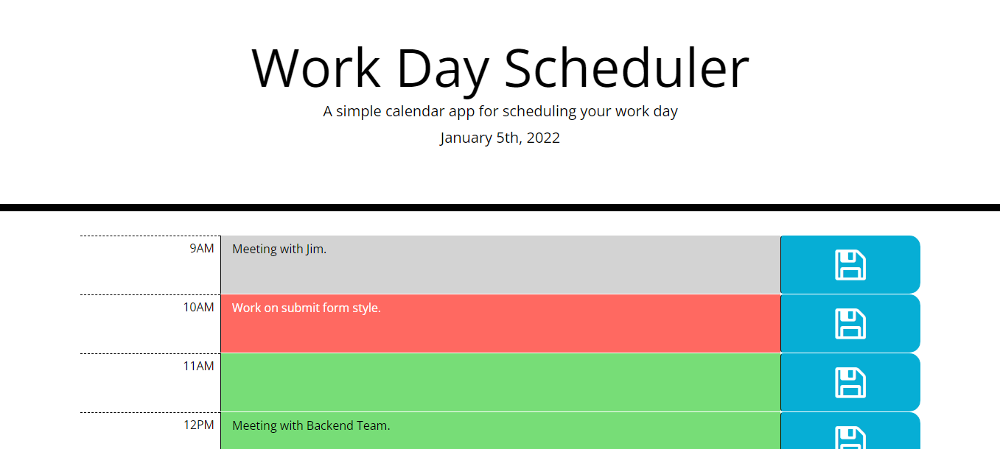
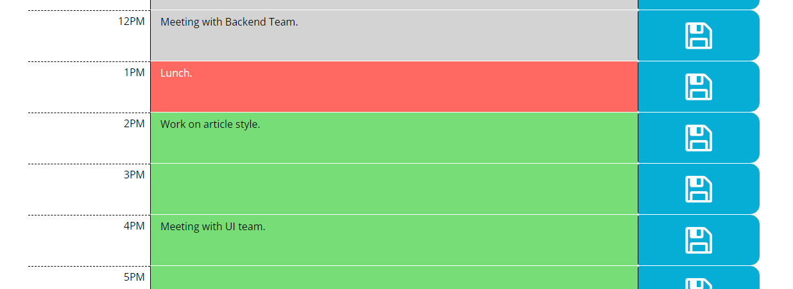

# Simple Workday Scheduler

# Description

A project for my bootcamp to create a simple workday scheduler. This has a small section for every hour (from 9am to 5pm), that the user can type in or change their plans. They can then save these changes with the button on the side, and this will keep that plans saved in local storage.

The page also tracks what day it is, and what the current hour is. Any blocks before the current hour is colored grey, the current hour is colored red, and future hours are colored green.

# Tech Used

- HTML
- CSS
- JS
- [Moment.Js](https://momentjs.com/)

# Webpage Link

[Please click here to view the webpage.](https://wruback.github.io/WR-Workday-Scheduler/)

# Webpage Appearance

## Contributors

- William Ruback - wrubackdev@gmail.com

## License

>MIT License
>
>Copyright (c) 2022 William Ruback
>
>Permission is hereby granted, free of charge, to any person obtaining a copy
of this software and associated documentation files (the "Software"), to deal
in the Software without restriction, including without limitation the rights
to use, copy, modify, merge, publish, distribute, sublicense, and/or sell
copies of the Software, and to permit persons to whom the Software is
furnished to do so, subject to the following conditions:
>
>The above copyright notice and this permission notice shall be included in all
copies or substantial portions of the Software.
>
>THE SOFTWARE IS PROVIDED "AS IS", WITHOUT WARRANTY OF ANY KIND, EXPRESS OR
IMPLIED, INCLUDING BUT NOT LIMITED TO THE WARRANTIES OF MERCHANTABILITY,
FITNESS FOR A PARTICULAR PURPOSE AND NONINFRINGEMENT. IN NO EVENT SHALL THE
AUTHORS OR COPYRIGHT HOLDERS BE LIABLE FOR ANY CLAIM, DAMAGES OR OTHER
LIABILITY, WHETHER IN AN ACTION OF CONTRACT, TORT OR OTHERWISE, ARISING FROM,
OUT OF OR IN CONNECTION WITH THE SOFTWARE OR THE USE OR OTHER DEALINGS IN THE
SOFTWARE.
